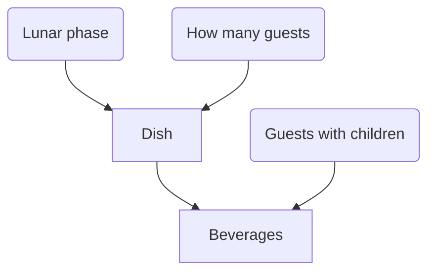

# dmn-check

This is a tool for the validation of [Decision Model Notation (DMN)](https://en.wikipedia.org/wiki/Decision_Model_and_Notation) files. It
performs various static analyses to detect inconsistencies and bugs in your decision models.

You can use `dmn-check` in three ways.

* As a [Maven](https://maven.apache.org/) or [Gradle](https://gradle.org/) plugin that can be integrated into your build
  process and continues integration to prevent bugs from slipping into your artifacts.
* Integrated into the [Camunda Modeler](https://camunda.com/products/modeler/) via the dmn-check plugin.
* Integrated into your custom tools by using the artifacts [dmn-check-core](https://search.maven.org/artifact/de.redsix/dmn-check-core) or
  [dmn-check-validators](https://search.maven.org/search?q=a:dmn-check-validators).

Currently, dmn-check checks among others for the following:

* Duplicate rules
* Conflicting rules
* Shadowed rules
* Types of the expressions
* Correct use of enumerations
* Correctly connected requirement graphs

In section [validations](#validations), you find a complete list with detailed descriptions of what they do.

Most properties and invariants that are validated by `dmn-check` are described informally in
the [DMN specification](https://www.omg.org/spec/DMN). In case you have questions about a validations it might be worth
to skim the specification.

## Maven Plugin

### Prerequisites

This plugin requires Java 11 or later and Apache Maven 3 or later. Some analyses are tailored towards the Camunda DMN implementation and
might not work for different DMN implementations.

### Usage

`dmn-check` can be used either as a normal Maven plugin inside your projects `pom.xml` or as a standalone program.

#### Configuration in POM

The following example shows the basic configuration of the plugin:

	        <plugin>
                <groupId>de.redsix</groupId>
                <artifactId>dmn-check-maven-plugin</artifactId>
                <version>...</version>
                <executions>
                    <execution>
                        <phase>verify</phase>
                        <goals>
                            <goal>check-dmn</goal>
                        </goals>
                    </execution>
                </executions>
            </plugin>

Using this configuration, the plugin will search all folders of the current project for files with the extension `.dmn` and apply all
available validators. It is possible to provide a set of search paths instead, as well as to ignore certain files and specify the validators
that should be executed. The following example shows how you can make use of these options by restricting the search path to the
folders `src/` and `model/`, as well as ignoring file `test.dmn`. The configuration further specifies that only
the [`ShadowedRuleValidator`](#shadowed-rules) should be executed. To specify validators, you have to use the fully-qualified name.

                <configuration>
                    <searchPaths>
                        <searchPath>src/</searchPath>
                        <searchPath>model/</searchPath>
                    </searchPaths>
                    <excludes>
                        <exclude>test.dmn</exclude>
                    </excludes>
                    <validatorClasses>
                        <validatorClass>de.redsix.dmncheck.validators.ShadowedRuleValidator</validatorClass>
                    </validatorClasses>
                </configuration>

Additionally, the `failOnWarning` (default is false) parameter can be set to fail a Maven execution if there are
validation errors with Warning severity.

                <configuration>
                    <failOnWarning>true</failOnWarning>
                </configuration>

#### Standalone Usage

To use `dmn-check` without or outside a Maven project, you can invoke it in the following way

        mvn de.redsix:dmn-check-maven-plugin:check-dmn

## Gradle Plugin

### Prerequisites

This plugin requires Java 11 or later and Gradle 6.5 or later. Some analyses are tailored towards the Camunda DMN implementation and
might not work for different DMN implementations.

## Integrated in dmnmgr

dmnmgr is _a toolkit incoperating the Camunda DMN implementation and providing tools to develop DMN based applications in cross functional teams._ It ships with a `dmn-check` integration and visualizes the warnings and errors in the graphical representation of the DMN model. You need to install the [dmnmgr-client](https://github.com/davidibl/dmnmgr-client) and [dmnmgr-server](https://github.com/davidibl/dmnmgr-server) to use it.

## Validations

The following subsections describe the available validations in detail. The DMN decision tables used in this section are derived from an
example on [camunda.org](https://camunda.org/).

### Duplicate Rules

Consider the following DMN decision table with hit policy `UNIQUE`:

|     | Season ᴵᴺᴾᵁᵀ  | How many guests ᴵᴺᴾᵁᵀ | Dish ᴼᵁᵀᴾᵁᵀ |
| --- | ------------- | --------------------- | ----------- |
|  1  | "Fall"        | <= 8                  | "Spareribs" |
|  2  | "Winter"      | <= 8                  | "Roastbeef" |
|  3  | "Spring"      | [5..8]                | "Steak"     |
|  4  | "Winter"      | <= 8                  | "Roastbeef" |

It is pretty obvious that rule number two is a duplicate of rule number four. This is not allowed by the `UNIQUE` hit policy
and thus an error.

**Definition**: A rule is a duplicate of another rule if and only if all inputs and outputs of those rules are identical.

`dmn-check` will report duplicate rules for all decision tables except for those with hit policy `COLLECT`.

### Conflicting Rules

Conflicting rules are somewhat similar to duplicate rules. Consider the following example with hit policy `UNIQUE`:

|     | Season ᴵᴺᴾᵁᵀ  | How many guests ᴵᴺᴾᵁᵀ | Dish ᴼᵁᵀᴾᵁᵀ |
| --- | ------------- | --------------------- | ----------- |
|  1  | "Fall"        | <= 8                  | "Spareribs" |
|  2  | "Winter"      | <= 8                  | "Roastbeef" |
|  3  | "Spring"      | [5..8]                | "Steak"     |
|  4  | "Winter"      | <= 8                  | "Stew"      |

We look again a rule two and four. This time, all their inputs are identical, but they differ in the output. This is arguably worse than a
duplicate rule, since it may produce different results depending on the evaluation order of the decision table. Assuming that the runtime
does not detect those inconsistencies.

**Definition**: Rule `r` is in conflict with rule `s` if and only if all inputs of rules `r` and `s` are identical and if they differ
in at lease one output.

`dmn-check` will report duplicate rules for all decision tables, except for those with hit policy `COLLECT` and `RULE_ORDER`.

### Shadowed Rules

Some rules prevent others from even being considered. Have a look at the following example with hit policy `FIRST`:

|     | Season ᴵᴺᴾᵁᵀ  | How many guests ᴵᴺᴾᵁᵀ | Dish ᴼᵁᵀᴾᵁᵀ |
| --- | ------------- | --------------------- | ------------|
|  1  | "Fall"        | <= 8                  | "Spareribs" |
|  2  | "Winter"      | <= 8                  | "Roastbeef" |
|  3  | –             | –                     | "Stew"      |
|  4  | "Spring"      | [5..8]                | "Steak"     |

This example contains no duplicate rules and no conflicting rules. However, all inputs of rule three are empty (represented with a dash in
this example). As empty inputs match everything and since we assume hit policy `FIRST` rule four will never match as rule three matches for
all possible inputs. Therefore, stew is served to the guests of 5 to 8 in Spring. Assuming that each rule serves a purpose, shadowed rules are
always an error as they will never be matched.

**Definition**: Rule `r` shadows rule `s` if and only if the inputs of rule `r` matches at least for all values for which the inputs of
rule `s` match.

`dmn-check` will report duplicate rules for all decision tables except for those with hit policy `COLLECT` and `RULE_ORDER`.

### Types of Expressions

DMN offers a rich expression language called [Friendly Enough Expression Language](https://docs.camunda.io/docs/components/modeler/feel/what-is-feel/) (FEEL) that can be used to describe the conditions for the input entries. However, as with most
expression languages, not all syntactically possible expressions are valid (have semantic). `dmn-check` integrates a type checker for the
FEEL expression language that ensures that a decision table contains only well-typed expressions.

An example of an ill-typed expression is `[1..true]` which would describe the range between `1` and `true` which is (at lease in FEEL) not a
valid expression. In contrast, `[1..9]` is well-typed and describes the numbers from 1 to 9. 

| FEEL-Expression  |  Type   |
| ---------------- | -----   |
| true             | boolean |
| [1..3]           | integer |
| [1.."string"]    | ✘       |
| 1, 2, true       | ✘       |
| > 5              | integer |
| > true           | ✘       |

Of course the type declaration is validated as well.

### Correct use of Enumerations

Decision-making often involves a fixed set of values (e.g. a list of supported currencies) and therefore those values are used in DMN
decision tables. Those values are often implemented in form of Java enums. `dmn-check` also to specify the fully-qualified class name of an
enum in the type declaration of the input- / output-column and checks the values in the DMN decision table against the enum implementation.

### Correctly Connected Requirement Graphs

The DMN standard also provides a way to connect decisions tables with each other and to model inputs and knowledge sources. The resulting
graphs are called [Decision Requirement Graphs (DRG)](https://docs.camunda.org/manual/latest/reference/dmn/drg/).

`dmn-check` verifies that a Decision Requirement Graph
- is [connected](https://en.wikipedia.org/wiki/Connectivity_(graph_theory)) 
- is [acyclic and directed](https://en.wikipedia.org/wiki/Directed_acyclic_graph)  
- ensures compatibility of in- and outputs
- has only one leaf node (i.e. exactly one node determines the output)
- has no (self-) loops

In the following example, decision table `Dish` has `Season` and `How many guests` as inputs, but instead of the input `Season` there is an
input `Lunar phase` connected to the decision table.

### Correct use of Aggregations

The DMN standard allows the aggregation of values for hit policy collect. For example, you can compute the sum of all
matching rows in a decision table. You could use this feature to calculate a credit score.

We ensure that those aggregations are only applied to columns with a numeric type. In addition, we validate that
aggregations are only used when hit policy collect is used.

### Missing Ids and Names

Usually you do not have to care much about ids and names of DMN elements. However, during upgrades and refactoring it
might happen that an id or a name is lost. Those errors usually stay unnoticed for a long time. Depending on the scenario
missing ids or names might break your decision model or make error analysis tricky.

`dmn-check` validates that the following DMN elements always have an id and a name:
- Decision
- Definition
- InputData
- ItemDefinition
- KnowledgeSource

### Allowed Values from `ItemDefinition`s 

`ItemDefinition`s are DMNs way to express enumeration. In the definition of an `ItemDefinition` you declare which
values are allowed. Currently, we only validate if the expressions from an `ItemDefintion` is well-typed.

## Related work

Although there are not many tools for analysis of DMN files, there exists some related work. Yet, we were not aware of most of the related
work when starting the work on `dmn-check`.

### A Tool for the Analysis of DMN Decision Tables

Ülari Laurson and Fabrizio Maria Maggi extended the `dmn-js` editing toolkit of Camunda with analysis capabilities and published it
at [github.com/ulaurson/dmn-js](https://github.com/ulaurson/dmn-js). The tool is able to detect syntax and type errors and to identify
overlapping and missing rules. It also is able to simplify decision tables by merging rules. In the demo paper [LM16](#LM16) they describe
the tool. Further details about the analyses performed by the tool are published in [CDL+16](#CDL+16).

## References

<b id="CDL+16">CDL+16</b> Calvanese, D., Dumas, M., Laurson, Ü., Maggi, F.M., Montali, M., Teinemaa, I.: Semantics and analysis of DMN
decision tables. In Proceedings of the 14th International Conference on Business Process Management (BPM) 2016

<b id="LM16">LM16</b> Laurson, Ü. and Maggi, F.M., 2016, September. A Tool for the Analysis of DMN Decision Tables. In BPM (Demos) (pp.
56-60).

<b id="BW-a">BW-a</b> Batoulis, K. and Weske, M., A Tool for Checking Soundness of Decision-Aware Business Processes.

<b id="BW-b">BW-b</b> Batoulis, K. and Weske, M., Disambiguation of DMN Decision Tables.

<b id="FMTV18">FMTV18</b> Figl, K., Mendling, J., Tokdemir, G. and Vanthienen, J., 2018. What we know and what we do not know about DMN.
Enterprise Modelling and Information Systems Architectures, 13, pp.2-1.

<b id="Silver16">Silver16</b> Silver, B., 2016. Decision Table Analysis in DMN.

<b id="HDSV17">HDSV17</b> Hasic, F., De Smedt, J. and Vanthienen, J., 2017. Towards assessing the theoretical complexity of the decision
model and notation (dmn). Enterprise, Business-Process and Information Systems Modeling. Springer International Publishing.
